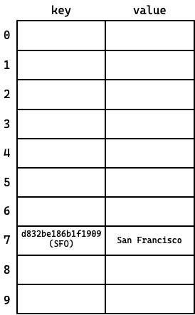
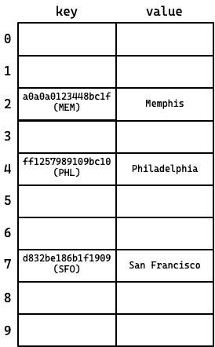
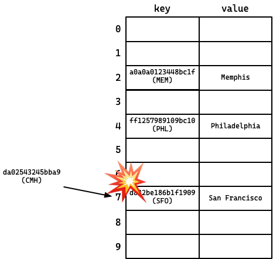
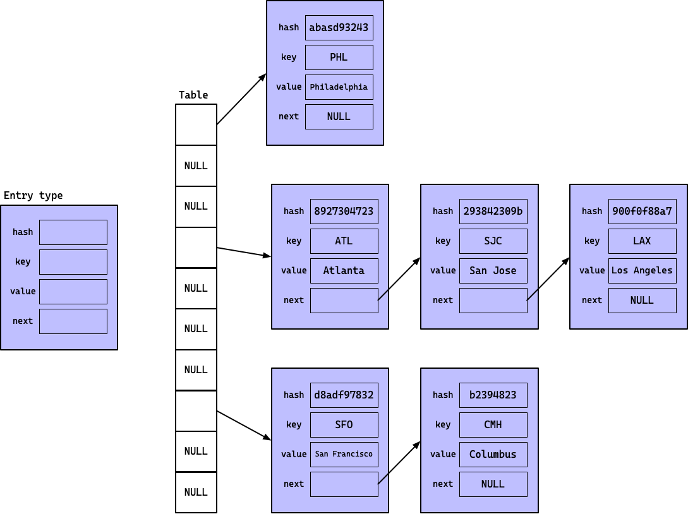

<a name="toc"></a>
<!--ts-->
* [Introduction](#introduction)
   * [Collaboration policy](#collaboration-policy)
* [Maps](#maps)
   * [Hash tables implement maps](#hash-tables-implement-maps)
* [From Key/Value to Hash Table](#from-keyvalue-to-hash-table)
   * [Enter hash tables](#enter-hash-tables)
   * [Collisions](#collisions)
   * [Resolving collisions with chaining](#resolving-collisions-with-chaining)
   * [Must read/watch info!](#must-readwatch-info)
* [Overview of the Lab Structure](#overview-of-the-lab-structure)
   * [Build Targets](#build-targets)
* [Unit tests](#unit-tests)
   * [Tests for this lab](#tests-for-this-lab)
* [Larger test programs](#larger-test-programs)
   * [idriver](#idriver)
   * [word_count](#word_count)
   * [stress_test](#stress_test)
* [Implementation Tips](#implementation-tips)
* [Turning it in](#turning-it-in)

<!-- Created by https://github.com/ekalinin/github-markdown-toc -->
<!-- Added by: langm, at: Fri Mar 10 01:35:09 CST 2023 -->

<!--te-->

__This lab is complex. It is important that you read this documentation before
starting your work.__

# Introduction

In this lab, you will use dynamic memory management in C to implement a
fundamental data structure: a hash table.

The objectives of this lab are:

* to gain experience writing programs that explicitly manage their own memory
  rather than relying on a garbage collection;
* to gain experience writing real, useful general-purpose library code that will
  be used by client programs;
* to gain experience programming to an interface;
* to implement a linked data structure in C;
* and to learn about hash tables and one implementation of them.

The outline of this document is as follows:

* First, we will introduce some background information about maps and hash
  tables. You will see that there are different hash table implementations and
  that we will be implementing a hash table with _chaining_.

* Next, we'll look at the structure of the lab, including the source files and
  build targets.

* The lab includes a suite of unit tests that you will use to validate the
  correctness of your hash table. We'll look at how to run them and discuss unit
  testing in C.

* The lab also includes three different larger programs that will test your hash
  table implementation. We'll talk about each of them and what they test.

* Finally, we'll discuss strategies for implementing the hash table and close
  with some general tips and advice.

To get started (__remember to work in a branch!__):

```
$ git clone <your-repo-url>
$ cd <cloned-repo>
$ git checkout -b <your-branch>
```

## Collaboration policy

It is fine to collaborate for this project. However, all code that you turn in
must be your own. You may not copy code directly from others or from the
internet. Copying code and renaming variables _is copying code._

You can and should talk about general problems in the lab, how to use specific
functions, etc.

__When you make your PR, note who you worked with and on what
phases/sections/functions/etc.__ If you do __not__ do this but you do work with
others, I will find it extremely suspicious if your code is similar...

🔝 [back to top](#toc)

# Maps

A map (also called an associative array or dictionary) is a common data
structure that is part of the standard library of many programming languages.

A map is a data structure that supports two main operations: `put` and `get`.
These operations are used to associate string _keys_ with associated _values_.

For example, this is how the built-in Python
[dictionary](https://docs.python.org/3/tutorial/datastructures.html#dictionaries)
type associates string keys with values:

```Python
m = dict()            # create a dict 
m["name"] = "marion"  # associate the key "name" with the value "marion"
m["city"] = "SF"      # associate the key "city" with "SF"

# print "marion lives in SF"
print(m["name"] + " lives in "  + m["city"])

m["city"] = "memphis" # update value associated with "city"

# print "marion lives in memphis"
print(m["name"] + " lives in "  + m["city"])
```

Java's [`Map`
interface](https://docs.oracle.com/en/java/javase/18/docs/api/java.base/java/util/Map.html)
is similar:

```
Map<String, String> m = new HashMap<>();  // create a map
m.put("name", "marion");                  // associate "name" with "marion"
m.put("city", "SF");                      // associate "city" with "SF"

// print "marion lives in SF"
System.out.println(m.get("name") + " lives in " + m.get("city"));

m.put("city", "memphis");                 // associate "city" with "memphis"

// print "marion lives in Memphis"
System.out.println(m.get("name") + " lives in " + m.get("city"));
```

Many other languages (e.g., C++, Go, Javascript, Swift, C#, Objective-C, etc.)
all have a map type in their standard library.

C, on the other hand, has an extremely limited standard library. This is
purposeful--the modern use of C is as an extremely low-level systems language.
It is also unfortunate, since there _are_ many times where we want to be able to
use a rich standard library of data types and we are not quite so concerned with
optimizing those data types for our specific use cases.

In this lab, we'll be implementing a map type in C. Our map implementation will
use a hash table.

## Hash tables implement maps

A _hash table_ is a data structure for _efficient_ insert/lookup operations of
keys. A hash table is often used "under the hood" to implement a map type. 

For example, dictionaries in Python are built using hash tables.
[`HashMap`](https://docs.oracle.com/en/java/javase/18/docs/api/java.base/java/util/HashMap.html)
is an implementation of `Map` in Java. C++ has the
[`std::unordered_map`](https://cplusplus.com/reference/unordered_map/unordered_map/)
type, which is implemented by a hash table. Go's `map` type is a [hash
table](https://go.dev/blog/maps).

The hash table interface is quite similar to a map; its primary operations are
`put`/`get` for keys.

Before we begin our discussion of hash tables, let's first start with a
discussion of how we might implement a map.

🔝 [back to top](#toc)

# From Key/Value to Hash Table

Let's start by looking at how we might implement a map with `put`/`get`
operations on string key/value pairs.

Take a look back at the example code in the last section, where we associated
the keys "name" and "city" with "marion" and "SF".

We could implement this data structure by keeping a sort of table with a column
for the key and a column for the value:

key | value
--|--
`name` | `marion`
`city` | `SF`

Let's shift our example, and look at mapping airport codes ("MEM") to cities ("Memphis").

key | value
-- | --
SFO | San Francisco
MEM | Memphis
DFW | Dallas - Fort Worth
ORD | Chicago
JFK | New York
CLE | Cleveland
PHL | Philadelphia
SJC | San Jose
IAH | Houston
DEN | Denver
CMH | Columbus
... | ...

Given this table, how long would it take for you to look up a city name given
its airport code (e.g., what is the city that corresponds to IAH)?

Notice that __the table is not sorted__: you would have to scan through each entry
until you found the code that you were looking for. You would have to run a
_linear search_ of the table.

Of course you could be lucky, and it could be the first code in the table.
However, in the _worst case_, this would be _all_ of the codes -- this is a
_O(n)_ ("big O of n") algorithm, where _n_ is the number of entries in the
table. 

Note that if we wanted to _add_ a new element to the table we can do that very
quickly! If there's room, we can just append it to the end of the table.

So, if the table is not sorted by key, `put` is constant time (_O(1)_), but
`get` is linear (_O(n)_).

We learned in COMP142 that if we want to reduce the worst-case lookup time, we
could sort the table. If the data is sorted, we would could use binary search on
the entries. This would reduce the worst case to _O(log2(n))_.

However, if we want to add an element to a sorted table, we now need to make
sure that we put the element in the correct location. To do so, we would need to
scan the entries--an _O(n)_ algorithm.

We're left with a __trade-off__: an unsorted table is more efficient for
inserts/`puts`, but less efficient for lookups/`gets`, while a sorted table is
more efficient for lookups/`gets`, but less efficient for inserts/`puts`. 

Reasoning about __trade-offs__ is a fundamental part of being a computer
scientist. However, in this case, we don't __need__ to make a trade-off. We can
have the best of both worlds!

## Enter hash tables

Hash tables are a way of making both of these operations--inserting new data and
querying for existing data--extremely efficient. In fact, they are both
constant time (_O(1)_)!

__The main insight for how we can do this is the following:__

* We can apply a constant-time function to the keys in the table that transforms
  a string into number. This function is called a _hash function_. For example,
  `hash("hello") = 782634236`.
* When we want to put an element into the table, we first _hash_ its key. 
* That gives us a number, which we then use to go to a specific, pre-determined
  location by performing a modulus operation on the hash value.
  (`hash("hello") % 100 = 36`).

Since each of those operations (hash, modulus, direct memory access) are each
constant time (with respect to the size of the table), this is a constant time
operation!

Let's look at an example. Let's say I have a table with 10 spots:


Now, we want to put the key/value `SFO`/`San Francisco` in the table. First, we
compute the _hash_ of `SFO`.

> Good hash functions are seemingly-random and make sure that even similar
> strings hash to very different numbers.  In this lab, we'll use a super simple
> and fast hash function (FNV-1) that gives us back a 64-bit number. Here's a
> site where you can experiment with hashing different strings:
> [link](https://md5calc.com/hash/fnv164).

As you can see, the [hash of SFO](https://md5calc.com/hash/fnv164/SFO) is
`d832be186b1f1909` (note that here we use hex because we are less concerned with
the numeric value of the 64-bit number and _more_ concerned with the fact that
it's a 64 bit number).

Since our table has 10 slots, we will compute `hash("SFO") % 10` --
`d832be186b1f1909 % 10`.  That number is 7. Therefore, we put "SFO" in spot 7.



Now, let's add some other values.



Again, the reason why this is constant time for both putting elements into the
table and retrieving them is that we can compute the hash function in an amount
of time proportional to the key length (not the table length) _and_ once we have
done so, can access the correct location in the table for the key _directly_
(i.e., without iterating over the table)!

## Collisions

This is great! Constant time lookups and inserts! Well, we do run into a
problem. Although hash functions are chosen so that we almost never have two
strings that hash to the same value, we need to map these different values to a
small, fixed-size table. We can store at _most_ 10 entries before they start
needing to go in the same spots. We _will_ have two different hash values that,
when the modulus is applied, both map to the same spot in the table.

For example, what if we try to put `CMH` into the table? Well, it turns out that
`hash("CMH")` modulo 10 is 7. This is a problem--`hash("SFO")` modulo 10 is
_also_ 7.

Without any sort of way of storing multiple keys per spot in our table, we can't
put "CMH" in the table!



This is called a __collision__.

We need a way to handle these collisions. Fortunately, there are multiple
methods for resolving collisions. 

A common method is called _open addressing_, where we put `CMH` in the _next_
free spot. If we try to look up `CMH` and find `SFO` instead, we scan down the
table (this is called _probing_) until we find `CMH` _or_ we find a free spot
(and therefore we know `CMH` is not in the table).

## Resolving collisions with chaining

Another method is called _chaining_. This is the method we will implement in
this lab. In chaining, we make __each element of the hash table a linked list
node.__ If we put an element into the table and there is a collision, we simply
put the entry at the end of the linked list for that location.

> [Linked lists](https://en.wikipedia.org/wiki/Linked_list) are a COMP142+241
> topic. We will be spending some time in class with linked data structures, but
> it would be a good idea to
> [review](https://introcs.cs.princeton.edu/java/43stack/) material from
> previous courses and our books ([DIS
> 2.7.5](https://diveintosystems.org/book/C2-C_depth/structs.html#_self_referential_structs),
> [HFC Chapter 6](https://rhodes.box.com/s/ikhig2m483x1tgqvv6npo2lhwjrh66rm)).

When we want to look up a value, we go to the spot in the table where the key
should be and traverse the linked list there until we either find the entry or
we reach the end of the linked list.

Here's an illustration of what a hash table with chaining looks like. On the
left, we have a representation of a `struct` type that has four fields. This is
our `entry` type, and stores an entry in the hash table. On the right, we have a
representation of a hash table with 6 entries. Notice the way that we resolved
our `SFO`/`CMH` collision, as well as the way that we resolved collisions with
`ATL`/`SJC`/`LAX`. 



With chaining, each element in the table is stored in an `Entry` type, which has
the hash, the key, and the value for the element. Each `Entry` additionally acts
as a linked list node, and stores a pointer to a next element (if there is one).

> Whether chaining or open addressing is a more efficient implementation depends
> on several factors. One of which is the _load factor_ of the table: the ratio
> between the number of entries stored and the size of the table. As the load
> factor grows to 1 (i.e., the table is getting full), open addressing slows
> down, as there are long searches that may be required (depending on the
> ordering, each access may scan the whole table). When the load factor exceeds
> 1, chaining can still be used without resizing the table. 
>
> On the other hand, when the load factor is low and there are a lot of free
> entries, open addressing will be more efficient, as it has better _spatial
> locality_ (we'll talk about this in class soon).

## Must read/watch info!

* Brian Kernighan (one of the original authors of Unix at Bell Labs and author
  of the [C Programming Language
  book](https://en.wikipedia.org/wiki/The_C_Programming_Language)) gives an
  excellent little 10 minute talk on hash tables [here, on
  YouTube](https://youtu.be/qTZJLJ3Gm6Q), including a little overview about how
  they are implemented.

  This video is __MUST WATCH__ for this lab!

* The Wikipedia article on [Hash
  tables](https://en.wikipedia.org/wiki/Hash_table) is __quite__ good.

Whew! Now, on to the lab!

🔝 [back to top](#toc)

# Overview of the Lab Structure

```
lab3
|-- doc  ...................... Images used in this document                  
|   |-- ...
|   `-- airport-codes.txt ..... List of airport codes (just as FYI)
|-- README.md  ................ This document
`-- src ....................... Main source code directory
    |-- books ................. Files used for word count test
    |   |-- alice...txt 
    |   |-- ...
    |   `-- walde...txt
    |-- fnv64.h ............... The hash function we'll use
    |-- interactive_driver.c .. Test program to interact manually with a map
    |-- Makefile .............. Build rules
    |-- map.c ................. Main source code file -- ALL CODE GOES HERE
    |-- map.h ................. Header file for map; function declarations
    |-- rand1.h ............... Random number generator used in tests
    |-- reference ............. Test programs compiled with reference solution
    |   |-- idriver 
    |   |-- stress_test
    |   `-- word_count
    |-- stress_test.c ......... Test that stresses the map implementation
    |-- tests ................. Unit tests
    |   |-- airport_codes.c ... Airport codes used in tests
    |   |-- airport_codes.h ... Airport codes used in tests
    |   |-- fnv64_test.c ...... Unit tests for hash function
    |   |-- map_test.c ........ Main unit test file
    |   |-- test_utils.c ...... Unit test library for this class
    |   `-- test_utils.h ...... Unit test library for this class
    `-- word_count.c .......... Word frequency count test program
```

This lab has two main files that you'll be dealing with: `map.h` and `map.c`. 

Open `map.h` and look around. This file defines the interface that you will
have to implement. These are the function declarations that are used by other
programs, including all of the test programs in the lab. 

The `map.h` file's documentation is describes the correct behavior for the
implementation of the map functions. Programs that use the map rely on the
behavior described in this documentation.

You __must not__ modify this file, as part of the objective for this lab is for
you to get practice coding to a contract.

You'll notice that `map.h` only declares functions, it does not define them.

__This is your main task for the lab: to define the functions listed in
`map.h`.__ That code is in `map.c`. __This is the main file you'll be editing.__
If you open `map.c`, you'll find that there are basic skeleton functions. These
are only here so that the lab will compile initially.

One thing that is particularly important in `map.c` is the definition of both
the `map_t` struct and the `entry_t` struct.

I have provided sample implementations of these structs. The entries that I gave
you form a doubly linked list. You are free to modify these structs. However,
you __must__ implement chaining, and you __must__ be able to resize your map
type (i.e., you can't declare a fixed-size array of entries).

> __Important:__
> Spend some time reading `map.h` -- the documentation of these functions
> specifies exactly the behavior they need to implement. Your goal should be to
> implement each of these functions so that their behavior matches their
> documented specification.
>
> Also spend some time reading the other programs, and spend some time looking
> at the partial code in `map.c`. This code may help you!

One thing that you will notice when you read `map.h` is that the map functions
all deal with `void *` values. A `void *` (void pointer) is a variable that
stores a address, but has no information about _what type is stored at that
address_. This is how we implement
[polymorphism](https://docs.oracle.com/javase/tutorial/java/IandI/polymorphism.html)
in C.

When you see `int *`, you should read this type as "pointer to `int`".

When you see `void *`, you should read this type as __"pointer to anything"__.

> __Important:__
> I compiled a reference solution of the map against the targets for this lab.
> In the `reference/` folder, there are __working__ copies of the programs. You
> can use these to validate output, what the map should do in the interactive
> driver, etc.


## Build Targets

A Makefile has been provided with several make targets. In the rest of this
handout, we'll discuss the various test programs you've been given.

Command | Build action
--|--
`make` | builds the map code and all test programs.
`make test` | build and run unit tests.
`make test-leaks` | build and run unit tests using `valgrind` (described later).
`make clean` | cleans up all intermediate files and executables.
`make word_count` | builds the map and word count program.
`make stress_test` | builds the map and stress test program.
`make idriver` | builds the map and interactive test program.
`make run_word_count` | runs word count against "Alice in Wonderland" with `valgrind` to check for memory leaks and invalid accesses.
`make run_word_count OUTPUT=file` | same as above, but directs all output to a file that can be submitted with the lab.
`make run_stress_test` | runs stress test against your map.
`make run_stress_test OUTPUT=file` | same as above, but directs all output to a file that can be submitted with the lab.

🔝 [back to top](#toc)

# Unit tests

You've been given a suite of [unit
tests](https://en.wikipedia.org/wiki/Unit_testing). You may remember unit tests
from jUnit in COMP142/241. Unlike Java, where jUnit is a de-facto standard
framework for writing unit tests, C does not have a widely-agreed-upon default
framework.

Frameworks like [GUnit](https://github.com/cpp-testing/GUnit) or
[googletest](https://github.com/google/googletest),
[Boost.Test](https://www.boost.org/doc/libs/1_71_0/libs/test/doc/html/index.html),
[CTest](https://cmake.org/cmake/help/latest/manual/ctest.1.html),
[Catch](https://github.com/catchorg/Catch2),
[doctest](https://github.com/doctest/doctest) are commonly-used for C++. C has a
plethora of frameworks, the page for
[Check](https://check.sourceforge.net/doc/check_html/check_2.html#SEC3) lists
many of them.

The unit testing framework (`tests/test_utils.{h,c}`)used in this lab (and others in COMP251) is a very
simple solution written for this class. It's not as complex or fully-featured as
many frameworks, but allows for tests to be written simply and quickly.

## Tests for this lab

The unit tests for this lab are in `tests/map_test.c`. This file defines a
suite of ~30 unit tests that exercise pieces of functionality in your map.

You can run the tests with `make test` or `make test-leaks`. The latter runs the
tests with `valgrind` (discussed later). This will compile your code and run the
unit tests.

When a test fails, it indicates an assertion that failed to be met. When this
happens, you should spend some time _reading the code for the failed test._ This
will allow you to understand the circumstances under which your code failed to
meet expectations.

You can run the unit tests with `gdb` if you need to debug a test failure. You
can also run the tests manually, or with `make`.

```
$ make test                # build and run the test suite
$ ./tests/map_test         # run manually
$ gdb tests/map_test       # run the tests using the debugger
```

Your completed map implementation should pass all unit tests. __If your map has
no memory leaks, the leak test (`make test-leaks`) should pass with 0 leaks as
well.__

Example run of unit tests:

```
$ make test
./tests/fnv64_test;  ./tests/map_test;
--- tests/fnv64_test.c ---
Running test_empty ......(passed) ✅
Running test_aircodes ...(passed) ✅
Running test_long .......(passed) ✅
PASSED 🎉 (3 / 3 succeeded)
--- tests/map_test.c ---
Running test_create_basic ..................(passed) ✅
Running test_create_size ...................(passed) ✅
Running test_put_once ......................(passed) ✅
Running test_put_get_once ..................(passed) ✅
Running test_get_only_check ................(passed) ✅
Running test_get_not_present ...............(passed) ✅
Running test_put_get_many ..................(passed) ✅
Running test_put_get_one_collision .........(passed) ✅
Running test_put_get_many_collision ........(passed) ✅
Running test_remove_once ...................(passed) ✅
Running test_remove_many ...................(passed) ✅
Running test_remove_first ..................(passed) ✅
Running test_remove_last ...................(passed) ✅
Running test_remove_middle .................(passed) ✅
Running test_put_copys_key .................(passed) ✅
Running test_put_get_returns_same_object ...(passed) ✅
Running test_put_replace ...................(passed) ✅
Running test_put_replace_first .............(passed) ✅
Running test_put_replace_last ..............(passed) ✅
Running test_put_replace_middle ............(passed) ✅
Running test_resize_bigger .................(passed) ✅
Running test_resize_smaller ................(passed) ✅
Running test_resize_many ...................(passed) ✅
Running test_free ..........................(passed) ✅
Running test_metrics_zero ..................(passed) ✅
Running test_metrics_deep ..................(passed) ✅
Running test_metrics_simple ................(passed) ✅
PASSED 🎉 (27 / 27 succeeded)
```

The unit tests included in the lab provide decent test coverage, but they are by
no means complete. If you find bugs in your map that these tests did not catch,
you can write additional unit tests for extra points.

> As you can see, I have tests for my code too. Code without tests is buggy
> code. Code with tests is _less_ buggy code.

🔝 [back to top](#toc)

# Larger test programs

You've been given three separate test programs. Each test program is good for a
different purpose.

> __Important:__
> For each of the test programs, spend some time reading through the code and
> how they use the map. This will give you some insight into how you will
> implement it!

## `idriver`

Perhaps the most useful program that you've been given is `idriver`. This allows
you to interactively experiment with your map by calling its functions.
This allows you to interactively test your code. 

The `idriver` program is built from `interactive_driver.c`. 

`idriver` assumes that your keys and values are single word strings and are
delimited by spaces.

When you run the program, it presents you with a menu of commands that you can
run

This is a sample interaction I used to test my map:

```
$ make idriver
gcc -g -Wall -Werror   -c -o interactive_driver.o interactive_driver.c
gcc -g -Wall -Werror   -c -o map.o map.c
gcc -g -o idriver interactive_driver.o map.o

$ ./idriver
Interactive map tester: ? for help.
Commands:
        n <size>            create or reallocate map
        p <key> <value>     map[key] = value
        g <key>             get map[key]
        r <key>             remove map[key]
        f                   free map
        v                   dump map contents (tests apply_fn)
        s                   print map stats
        d                   call map debug function
        ?                   print this message
        e                   exit tester
> n 4
Allocating map with size 4...done.
> p SFO San-Francisco
Putting map[SFO] -> San-Francisco...done (is_new = 1)
> p PHL Philadelphia
Putting map[PHL] -> Philadelphia...done (is_new = 1)
> p MEM Memphis
Putting map[MEM] -> Memphis...done (is_new = 1)
> p SJC San-Jose
Putting map[SJC] -> San-Jose...done (is_new = 1)
> p CMH Cooooooooolumbus
Putting map[CMH] -> Cooooooooolumbus...done (is_new = 1)
> d
Calling map_debug...
0 d847a1186b314444 MEM(Memphis) -> X
1 d832be186b1f1909 SFO(San-Francisco) -> d832ca186b1f2de9 SJC(San-Jose) -> X
2  -> X
3 d83cea186b27b8c3 PHL(Philadelphia) -> d869a5186b4e3173 CMH(Cooooooooolumbus) -> X
done
> g ATL
Getting ATL...done; value = NULL (exists = 0)
> g MEM
Getting MEM...done; value = Memphis (exists = 1)
> g CMH
Getting CMH...done; value = Cooooooooolumbus (exists = 1)
> p CMH Columbus
Putting map[CMH] -> Columbus...done (is_new = 0)
> r PHL
Removing PHL...done (exists = 1)
> d
Calling map_debug...
0 d847a1186b314444 MEM(Memphis) -> X
1 d832be186b1f1909 SFO(San-Francisco) -> d832ca186b1f2de9 SJC(San-Jose) -> X
2  -> X
3 d869a5186b4e3173 CMH(Columbus) -> X
done
> n 1
Reallocating map to size 1...done.
> d
Calling map_debug...
0 d847a1186b314444 MEM(Memphis) -> d832be186b1f1909 SFO(San-Francisco) -> d832ca186b1f2de9 SJC(San-Jose) -> d869a5186b4e3173 CMH(Columbus) -> X
done
> n 6
Reallocating map to size 6...done.
> d
Calling map_debug...
0  -> X
1 d832be186b1f1909 SFO(San-Francisco) -> d869a5186b4e3173 CMH(Columbus) -> X
2 d847a1186b314444 MEM(Memphis) -> X
3  -> X
4  -> X
5 d832ca186b1f2de9 SJC(San-Jose) -> X
done
> q
```

You can use the reference solution (`src/reference/idriver`) program to
interactively test my map implementation, as well.

## `word_count`

`word_count` computes a frequency count of words in a text (e.g., "how often
does "alice" appear in "Alice in Wonderland?").

The word count implementation that you've been given will read an input text and
split the input into words. It will then store these words in the hash table,
along with the count of their frequency.

The algorithm is essentially:
```
for each word in the input:
  if word is in the map:
    put(word, get(word) + 1)  # increment count
  else:
    put(word, 1)
```

At the end, the program uses the `map_apply` function to print out the counts.

Like the last program, it is __highly__ recommended that you spend time reading
the source so as to become familiar with how the map is used. This program
abuses the `void*` value and uses that like an integer!

You can use this program to test your `put`, `get`, and `resize`:

```
$ ./word_count -f books/alice-in-wonderland.txt | sort -nr | head
1632       the
845        and
721        to
627        a
537        she
526        it
508        of
462        said
401        i
386        alice
```

I recommend that you run `word_count` manually a few times when you think that
you have your hash table working correctly. It will probably expose some bugs.

You can use this program to also stress test your resize and your handling of
linked lists. The program takes optional parameters that allow you to specify
the size of the table that it creates and whether it should randomly try
resizing the table periodically.

```
$ ./word_count
Usage: word_count -f <file> [-s <size>] [-d] [-r]
Options:
        -f <file>  Count words in <file>
        -s <size>  Size of map
        -d         Print map debug stats
        -r         Periodically resize between 1 and 8k entries (stress test)
```

For example, the following will run word count with your map against Ulysses
with a map size of 20:

```
$ ./word_count -f books/ulysses.txt -s 20
```

Or do the same thing, but randomly resize the map along the way:

```
$ ./word_count -f books/ulysses.txt -r
```

__When you are confident that your map is working correctly, run the word count
with valgrind.__ Your book has instructions in chapter
[3.3](https://diveintosystems.org/book/C3-C_debug/valgrind.html), but you can
also just use the build target `make run_word_count` to run against valgrind
with random resizing on. 

__This takes about 30s to run.__

If you do not have any memory leaks, you should see output like this:

```
----------------------------------
Map Stats:
----------------------------------
num_entries:    2750
max_depth:      8
size:           1612
resize count:   2564
==53192==
==53192== HEAP SUMMARY:
==53192==     in use at exit: 0 bytes in 0 blocks
==53192==   total heap usage: 9,029,078 allocs, 9,029,078 frees, 297,501,813 bytes allocated
==53192==
==53192== All heap blocks were freed -- no leaks are possible
==53192==
==53192== For counts of detected and suppressed errors, rerun with: -v
==53192== ERROR SUMMARY: 0 errors from 0 contexts (suppressed: 0 from 0)
```

Here, valgrind tracked ~9 million calls to `malloc`, and each call had a
corresponding `free`. At the conclusion of the program, there was zero memory
left on the heap (meaning that all dynamically allocated data had been freed).

Valgrind will also check for memory errors (e.g., overwriting the bounds of an
array, for example) and include those in its report.

It is likely that you'll have to do some debugging here. Make sure you read this
document to the end! There are some debugging tips that you will find useful!

## `stress_test`

The last program is purely a stress test of your map. 

The program does the following:

* Given a specified number of keys (default 1024) and operations per-key
  (default 4), run a loop with `keys * operations_per_key` iterations:
  
  * Randomly put or remove a random key.

  * With a probability specified by a parameter, randomly resize the map within
    a factor of 2 of its initial size (default 256).

* Run the above several times (default 4).

The way that it runs this stress test is configurable. It takes a few parameters:

```
$ ./stress_test -h
Usage: stress_test [-s <size>] [-k <keys>] [-r <prob>] [-i <iters>] [-m <ops>]
Options:
        -r <prob>    probability of resize (0-100)
        -s <size>    size of map
        -i <iters>   iterations
        -m <ops>     operations per key
        -k <keys>    number of keys
```

Note that this stress test does something that word count didn't do: __remove
entries__. So, a passing word count program does not mean that this test will
pass! Use the same strategies that you used for debugging word count to debug
this.

Start off by running the stress test by itself:

```
$ ./stress_test
```

And add more keys, more resizes, more iterations per key, etc. to test your
program.

```
$ ./stress_test -r 50        # resize with 50% probability
$ ./stress_test -r 50 -m 6   # increase the number of per-test iterations
$ ...etc.
```

You can also use a build target to run valgrind (or run valgrind yourself,
manually). The build target that you can use is `make run_stress_test`.

__This will take a while (~1m30s)__. When you are done and you have no memory
leaks, you should see something similar to the following:

```
==54935== HEAP SUMMARY:
==54935==     in use at exit: 0 bytes in 0 blocks
==54935==   total heap usage: 40,887,203 allocs, 40,887,203 frees, 942,280,717
bytes allocated
==54935==
==54935== All heap blocks were freed -- no leaks are possible
==54935==
==54935== For counts of detected and suppressed errors, rerun with: -v
==54935== ERROR SUMMARY: 0 errors from 0 contexts (suppressed: 0 from 0)
```

Once you have finished debugging this, you can be quite confident in the
correctness of your hash table implementation. Congratulations! This is a
nontrivial data structure, and managing its memory can be difficult to get
right!

🔝 [back to top](#toc)

# Implementation Tips

* Watch the video linked to from the section on hash tables.

* Important chapters to review are 
  [1.6](https://diveintosystems.org/book/C1-C_intro/structs.html),
  [2.4](https://diveintosystems.org/book/C2-C_depth/dynamic_memory.html), and
  [2.7](https://diveintosystems.org/book/C2-C_depth/structs.html).

  The last two, in particular, talk a good bit about using structs and dynamic
  memory, pointers to structs, and structs containing pointers. 

* Though this lab is not broken up into phases, there are natural phases that
  you could divide the lab into. One set of these would be:

  1. `map_create`, `map_put`, and `map_debug`: With these, you can do quite a bit
     of debugging in the `idriver` tool.

  2. `map_get`: With these four functions, you can also do quite a bit of
     debugging, and you should be able to get a mostly-working `word_count` run.
     Although, you will definitely fail valgrind's memory checks  and you won't
     be able to use the resize testing that word count does.

  3. `map_resize`: I think this function is "easier" to write than `map_remove`
     and if you ignore memory leaks, you can do quite a bit of testing.

  4. `map_free`: After resize, this is a natural thing to do.

  5. `map_remove`: I think that this will probably challenge you the most (but I
     definitely could be wrong!), since it involves some careful pointer surgery
     and you easily leak memory here.

  Of course this is just a suggestion! There are many ways to approach this lab!

* Remember that `malloc` takes a _size in bytes_ as a parameter and `sizeof`
  takes a type as a parameter. Allocating a struct is
  `malloc(sizeof(my_struct))`. An _array_ of structs is
  `malloc(size_of_array * sizeof(my_struct))`. Not that this is different from
  an __array of pointers to structs__: `malloc(size_of_array * sizeof(my_struct
  *))` -- note the `*`!

* If you want to allocate enough room for a string, remember that all strings
  have a null terminator that is _not_ included in the length! `strlen("hello")`
  returns 5, but the _number of characters required to store the string is 6_.

  You'll need to keep this in mind when you are creating a copy of the key.
  Also, don't forget to free your copy of the key when an entry is removed or
  when the table is freed.

* Read the info on how to use `DEBUG_PRINT` in `map.c`. This is an __extremely__
  useful macro for debugging issues.

* To compute a hash of a key, you can just call `fnv64`.

* It is also extremely helpful to use assertions when you are programming data
  structures like this. An assertion makes the code fail when it is not met, and
  is a _great_ way of making absolutely sure that your code is not running for
  too long in an invalid state (this is too easy to do when you are dealing with
  juggling memory like you are in this data structure).

  Take a look at the asserts in `src/word_count.c`. You may find it useful to
  put these in your code. For example, one assertion that I checked when I was
  writing my implementation was that the next pointer is `NULL` for the tail of
  a list (`assert(!entry->next)`, if `entry` is the tail).

* Similarly, it is good practice to error-check the result of `malloc`. In this
  lab, it is fine if you just assert that the pointer returned by `malloc` is
  not null. For example:

  ```
  ptr = malloc(...);
  assert(ptr);
  ```

* Remember that you can use `calloc` to initialize the allocated memory to
  0/`NULL`. Or you can alternatively use `memset` to initialize a block of
  memory. This is helpful when allocating an empty array of pointers, for
  example.

* Don't try to implement `map_resize` with `realloc`, since you have to re-hash
  all the elements anyway. It is a lot easier to use the functions that you
  already have that add elements to a `map`!

* Make sure you spend a little bit of time with the `map_apply` function. It is
  a good example of how to traverse the entries in the map. You will have
  a very similar traversal in both `map_free` and `map_resize`. You will also
  have to traverse the linked list of entries in almost every function!

* I found my `map_debug` function extremely useful while debugging. You can see
  an example of its output in the sample interaction with the `idriver` program
  above. You should consider writing this function pretty soon after starting.

* My implementation is 185 lines of code, including comments, whitespace, and
  debug statements. 

* You don't _have_ to use my implementation, or all the fields that I defined in
  the data structures. For example, your list does not really need to be
  doubly-linked if you don't want to make it that way (though it does make
  implementing `map_remove` a little cleaner, in my opinion).

* Similarly, for statistics, you can either compute the statistics when the
  `map_metrics` function is called, _or_ you can keep track of some or all of
  those metrics while you are adding/removing entries. You can add fields to the
  struct if you wish.

* If you get a segfault, run the program again inside `gdb`. When it segfaults,
  use `info stack` to see where in your program you had a fault. Use `frame
  <frame-no>` to go back to that stack frame, and `info locals`/`print <var>`
  to examine the state of your program that lead to the crash.

  Segfaults are kind of nice to debug in this way -- you don't have to remember
  to set breakpoints... 🥹

  A [segfault](https://en.wikipedia.org/wiki/Segmentation_fault), or
  _segmentation fault_, happens when you try to access a memory location
  illegally (either because it is not a valid page, it's a null pointer, or it's
  a protected region of memory).

* When you get frustrated, or things stop making sense, take a step away from
  your code. You will _not_ be able to get this done in one sitting.

* This is another hard lab. I think that you will probably spend quite a bit of
  time getting this going initially, will finish the rest quite quickly, and
  then spend a long time debugging.

* When you get stuck, come see me. Ping me on Slack, come to my office, etc.

🔝 [back to top](#toc)

# Turning it in

__CONGRATULATIONS!__

Like before, make a pull request!

__Whether you have a perfect implementation or something with some bugs, at the
end of the day, _you should be proud_ of this!__

This is an extremely useful data structure to program, and this experience is an
important step in learning how to program!

🔝 [back to top](#toc)
